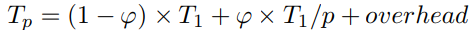

# Par teoria S3

## SpeedUp vs Efficiency

SpeedUp (Sp): relative reduction of execution time whn using P processors with respect sequential

Efficiency (Effp): it is a measure of the fraction of time for which processing element is usefull

## Escalability

> - Strong: resources x2 -> scalability x2
> - Weaak: resources x2 w. proportional work

## Amdahl's law

> φ (Par_Fraction) = Tseq_time_of_par_part / Tseq_exec

Note: <note>If P approach to infinit, φ/P approach to 0, then Sp = 1/(1-φ).</note>

Ex:

>        seq - 25s
>        par - 50s
>        seq - 25s
>              100s
> φ = 100/50 = 0,5
> SpeedUp par = 50/10 = 5
>
> SpeedUp = 100/60 = 1.67

## Sources of overhead
> - tark creation
> - barrier sync
> - tark sync
> - exclusive access to data
> - data sharing 
> - Idleness
> - Computation (extra work to obtain a palallel algorithm)
> - Memory (extra memory to obtain a palallel algorithm)
> - Contention (competition for the access to shared resources)

## How to model data sharing overload?
Example:
### Jacobi solver
> Tcalc = (N2/P)*tboddy
> 
> Tp = Tcalc + Tcomm
> 
> Tcomm = 2(ts+tw*N)