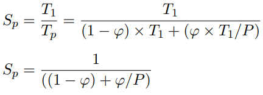

<style>
    @import url('https://fonts.googleapis.com/css?family=VT323');
    h1{
        text-align: center;
        font-size: 50px;
        font-family: 'VT323', monospace;
    }
    h2{
        font-weight: bold;
    }
    h3{
        font-weight: bold;
    }
    img {
        height: auto;
        width: 100%;
    }
    note {
        font-weight: lighter;
        background-color: rgba(100, 100, 100, 0.3);
        font-style: italic;
    }
    p{
        text-align: justify;
    }
    img{
        width: 100%;
        height: auto;
    }
    .center{
        width: 50%;
        height: auto;
        margin-left: auto;
        margin-right: auto;
        display: block;
    }
    module{
		border-top: 1px solid;
	}
    .half{
        width: 50%;
        height: auto;
        margin-left: auto;
        margin-right: auto;
    }
    .no_border{
        margin: 0px;
    }
    .emoji {
        height: 1.2em;
    }
</style>

# Understanding parallelism

## SpeedUp vs Efficiency

SpeedUp (S<sub>p</sub>): relative reduction of execution time whn using P processors with respect sequential.

Efficiency (Eff<sub>p</sub>): it is a measure of the fraction of time for which processing element is usefull.

## Escalability

> - Strong: resources x2 -> scalability x2
> - Weaak: resources x2 w. proportional work

## Amdahl's law

### Par_Fraction
> φ= T<sub>seq_time_of_par_part</sub> / T<sub>seq_exec</sub>



<note>If P approach to infinit, φ/P approach to 0, then S<sub>p</sub> = 1/(1-φ).</note>

Ex:

>        seq - 25s
>        par - 50s
>        seq - 25s
>              100s
> φ = 100/50 = 0,5
> SpeedUp <sub>par</sub> = 50/10 = 5
>
> SpeedUp = 100/60 = 1.67

## Sources of overhead
> - task creation
> - barrier sync
> - task sync
> - exclusive access to data
> - data sharing 
> - Idleness
> - Computation (extra work to obtain a palalel algorithm)
> - Memory (extra memory to obtain a palalel algorithm)
> - Contention (competition for the access to shared resources)


## How to model data sharing overload?
Example:
### Jacobi solver
> T<sub>calc</sub> = (N<sup>2</sup>/P)*t<sub>boddy</sub>
> 
> T<sub>p</sub> = T<sub>calc</sub> + T<sub>comm</sub>
> 
> Tcomm = 2(t<sub>s</sub>+t<sub>w</sub>*N)

## Data sharing modeling

### Example 4
```
void compute(int n, double *u, double *utmp) {
    int i, j;
    double tmp;
    for (i = 1; i < n-1; i++) {
        for (j = 1; j < n-1; j++) {
            tmp = u[n*(i+1) + j] + u[n*(i-1) + j] + // elements u[i+1][j] and u[i-1][j]
            u[n*i + (j+1)] + u[n*i + (j-1)] - // elements u[i][j+1] and u[i][j-1]
            4 * u[n*i + j]; // element u[i][j]
            u[n*i + j] = tmp/4; // element u[i][j]
        }
    }
}
```
Each cpu with n<sup>2</sup>/P elements. Tasks compute segments of n/c rows by c columns.

Then, time acquire the following form:


<div class=page>

# Task decomposition


Types:
- Lineal Task decomposition
>   Code block or procedure
- Iterative task decomposition
>   Iterative constructs
- Recursive task decomposition
>   Recursive procedures

## Decomposition Strategies

### Leaf strategy

Create one task sequentially for each leaf of task tree. 

>Less tasks
>
>Less overhead

### Tree strategy

Creator one task for each invocation.

> More Tasks
> 
> More Overhead

## Cut-off control

If tree strategy is in use, when a certain number of task are created or the granulation si too small or in a certain number of recursive calls; you can change the strategy to Leaf in order to reduce overhead.

## Task ordering constraints

### Dependences

#### Constrains in the paralel execution of tasks

- Task ordering costraints

        They force the execution of tasks in a requiered order
- Data sharing constraints
    
        They force the access to data to fulfil certain properties.

### Task ordering constraints

- Control flow constraints
>   The creation of a task depends on the outcome (decision) of one or more previous tasks.
- Data flow constraints
>   The execution of a task can not startuntil one or more previous tasks have computed some data.

### Task synchronization in Open MP

- Thread barriers
>   Wait for all threads to finish previous work.
- Task barriers
    -taskwait
>               Suspends the current task waiting on the completion of child tasks of the current task. (stand-alone directive).
    -taskgorup
>               Suspends the current task at the end of structured block waiting on completion of child tasks of the current task and their descendent tasks

- Task dependences

### Task dependences

- IN
- Out
- InOut
 
You can creat a dependence fro a part of a task. For example a coss-iteration dependence.

## Task ordering constrains

- Task ordering constraints
- Data sharing constraints

## Problem 1

Given the following C code with tasks identified using the T areador API:

```
#define N 4
int m[N][N];

// initialization
for (int i=0; i<N; i++) {
    tareador_start_task ("for_initialize");
    for (int k=i; k<N; k++) {
        if (k == i) modify_d(&m[i][i], i, i);
        else {
            modify_nd (&m[i][k], i, k);
            modify_nd (&m[k][i], k, i);
        }
    }
    tareador_end_task ("for-initialize");
}

// computation
for (int i=0; i<N; i++) {
    tareador_start_task ("for_compute");
    for (int k=i+1; k<N; k++) {
        int tmp = m[i][k];
        m[i][k] = m[k][i];
        m[k][i] = tmp;
    }
    tareador_end_task ("for-compute");
}

// print results
tareador_star_task ("output");
print_results(m);
tareador_end_task ("output");
```

Assuming that: 1) the execution of the modify_d routine takes 10 time units and the execution of the
modify_nd routines takes 5 time units; 2) each internal iteration of the computation loop (i.e. each
internal iteration of the for_compute task) takes 5 time units; and 3) the execution of the output task takes
100 time units.

1. Draw the task dependence graph (TDG), indicating for each node its cost in terms of execution time
(in time units).
    


2. Compute the values for T1, T∞, the parallel fraction (phi) as well as the potential parallelism

T<sub>1</sub> = 230

T<sub>inf</sub> = 155

Phy = 130/230

Par = T1/Tinf = 230/155

3. Indicate which would be the most appropriate task assignment on two processors in order to obtain
the best possible "speed up". Calculate T2 and S2.

| cpu 1 | ini1 | ini4 | comp1 | | Output |
|:---:|:---:|:---:|:---:|:---:|:---:|:---:|
|**cpu 2** | **ini2** | **ini3** | **comp2** | **comp3** |  |

<div class="page">

# Introduction to shared-memory parallel architectures

## 3 Uniprocessor parallelism

### Pipelining

    Execution of single instruction divided in multiple stages.

Overlap the execution of different stages of consecutive instructions to reach the ideal CPI (CPI = 1).

If pipeline is blocked by an instruction that is whaiting for data, the processor can execute code out of order.

### Caches

- The principle of temporal and spatial locality

        The instructions could be referenced again soon or near addresses tends to be referenced soon.

- Line or block

        Cache are going to store near by data that are potientally referenced.

- Hit/Miss

### Special instructions

- ILP

        Instruction Level Parallelism

- TLP

        Thread Level Parallelism

- DLP

        Data Level Parallelism

### Who exploits this uniprocessor parallelism

- Software pipelining to statically schedule ILP.
- Unrolling loops to allow the processor to exploits ILP.
- Data distribution to efficiently exploit DLP.
- Data Blocking for cache.

## Symmetric multi–processor architectures


- Abbreviated SMP

        Two or more identical processors are connected to a single shared memory.

        Interaction Network.

- I Symmetric multiprocessing

        a single OS instance on the SMP.

- Uniform Memory Access
  
        Access to shared data with load/store instructions.

        The bottleneck is the bandwidth of the interconnection network and memory.

## Coherence protocols

- Write update

        Forces to update all other copies

        Higher bus traffic

- Write invalidate

        Forcves to invalidate all other copies

        The new value is provided to other processors when requered or when flusehd form cache.

## Snooping

### MSI write-invalidate snooping protocol

States:

    - Modified
    - CPU events
    - Bus transactions


### Minimizing sharing

#### False sharing

- Cache block may also introduce artefacts: two distinct
variables in the same cache block

- Technique: allocate data used by each processor contiguously,
or at least avoid interleaving in memory

- Example problem: an array of ints, one written frequently by
each processor (many ints per cache line)

## Non-Uniform Memory Architecture (NUMA)

### Directory-based cache coherency

Directory structure associated tto the node memory: one entery per block of memory.

- Status bits
- Sharers list

### Simplified coherency protocol

Possilbe commsnds arriving to home node form local node:

- RdREq: Asks for copy of block with no intent to modify.

- WrReq: Asks for copy of block with intent to modify or simply asks for permission to modify it.
  
- Dreply: Send clean copy of block.

- Fetch: Asks remote node for copy of block,

- Invalidate: Asks remote node to invalidate its copy.

### Possible states

**Node:**

- Local

- Home

- Owner/Remoto

**Opns:**

- RdReq

- WrReq

- Drepla

- Fetch

- Invalidate

**Stoles:**

- U (Uncoded)

- M (Modified)

- S (Shared)

### Support for sync at the architecture level

Need hardware support to guarantee atomic instruction to fetch and update memory

- Test-and-set (t&s): read value in location and set to 1
```
lock    t&s r2, flag    // Read "flag" from memory and set it to 1
        bnez r2, lock   // If it was 0, it following the execution, else repeat the loop
        (code)
unlock  st flag, #0     // Free look
```

- Atomic exchange: interchange of a value in a register with a value in memory

```
        daddui r2, r0, #1   // r0 always equals 0
lock:   exch r2, flag       // Atomic exchange
        bnez r2, lock       // If it was 0, it following the execution, else repeat the loop
        (code)             
unlock: st flag #0          // Free look
```

- Load-linked Store-Conditional (ll-sc)

Atomic exchange
```
try:    mov r3, r4
        ll r2, location
        sc r3, location
        beqz r3, try
        mov r4, r2
```

fetch and increment
```
try:    ll r2, location
        daddui r3, r2, #1
        sc r3, location
        beqz r3, try
```
* test-test-and-set 

Technique reduces the necessary memory bandwidth and coherence protocol operations required by a pure test-and-set based synchronization

```
lock:   ld r2, flag // test with regular load
                    // lock is cached meanwhile it is not updated
        bnez r2, lock // test if the lock is free
        t&s r2, flag // test and acquire lock if STILL free
        bnez r2, lock
        (code)
unlock: st flag, #0 // free the lock
```
## The memory consistency problem

Compiler and hardware can freely reorder operations to different memory locations, as long as data/control dependences in sequential execution are guaranteed.

<div class="page">

## Parallel programming principles: Data decomposition

1. Identify the data used and/or produced in the computations. <br>In, out or inout. 
2. Partition this data across various tasks.
3. Obtain a computational partitioning that corresponds to the data partition. <br>Owner-computes rule.
4. In distributed-memory architectures, add the necessary data allocation and movement actions.

## Guidelines for data decomposition

- Balanced data distribution.
- Some times is better to have replicated data than consult it every time.
- 