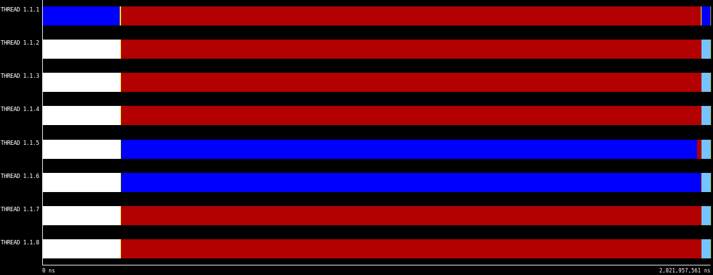

<style>
    h1{
        color: red;
        text-align: center;
        font-size: 50px;
        text-shadow: 2px 2px #ffcccc;
    }
    h2{
        font-weight: bold;
    }
    h3{
        font-weight: bold;
    }
    img {
        height: auto;
        width: 100%;
    }
    note {
        font-weight: lighter;
        background-color: rgba(100, 100, 100, 0.3);
        font-style: italic;
    }
    p{
        text-align: justify;
    }
    img{
        width: 100%;
        height: auto;
    }
    .center{
        width: 50%;
        height: auto;
        margin-left: auto;
        margin-right: auto;
    }
	module{
		border-top: 1px solid;
	}
</style>

# Lab 2

## Introduction

In lab 2 we are going to work with Mandelbrot Set. It is a set of complex numbers. With an algorithm to compute Mandelbrot Set we are going to obvserve how to paralelize in diferent ways. Point method and Row method are the methods we are going to work with.


<div class="page">

## Task decomposition and granularity analysis
First of all, take a look at the task dependence graph of point decomposition. At left is the glaphycal version, we can obvserve that it cannot be paraleliced. However the non display (right window) version is paraleliced. Then, whe can conclude, som part of display code is causing some dependences.
 
<note> Tareador captures of mandel-tar using point decomposition </note>

Using row decomposition, the result is similar then the previous version. Display version still have the same problem, a data dependence, and non-display version is paralel. Obviously the granularity is bigger. Unlike point decomposition, now we are compting a big number of points with only one task. It is going to reduce overhead time but increasing the granularity.


<note> Tareador captures of mandel-tar using row decomposition </note>

code:

```
(...)       
    for (row = 0; row < height; ++row) {
        tareador_start_task("mandelbrot row loop"); //Row decomposition
        for (col = 0; col < width; ++col) {
            tareador_start_task("mandelbrot col loop"); //Point decompsition

(...)
```
[mandel-omp.c](code/mandel-omp_v2.c)

Scale cxolor and display point causes dependency in the graphycal version. It uses vars.

The granularity in point method is smaller and with 64 threads the execution time is much lower than using row method. If you have enough cpus, the point strategy is more adequate, as it allows for a lower time, however, row method it's worth if you have less cores. You will reduce overhead time.

### Code protection:

X11 use a variable, named X11_COLO_fake, with dependences. With openMP you can declare critical regions. That protects your code while parallelize from decoherences.

```
(...)
#if _DISPLAY_
            /* Scale color and display point  */
            
            long color = (long) ((k-1) * scale_color) + min_color;
            if (setup_return == EXIT_SUCCESS) {
				#pragma omp critical (X11)
				{
                XSetForeground (display, gc, color);
                XDrawPoint (display, win, gc, col, row);
				}
            }
#else
(...)
```
[mandel-omp.c](code/mandel-omp_v2.c)

<div class="page">

## Point decomposition in OpenMP

With point decomposition, one task is created for every leaf of the three task sequentilly. 

The following plots are the time plot and speed up plot which shows the dependence between time or speed up and the number of cores used while the execution of the program.


<note> Elapsed time and Speed Up plot for point decomposition version of mandel-omp.c program.</note>

The following plots are representing the relation between different number of tasks created.


<note> Elapsed time, Speed Up plot and paraver trace for point decomposition version of mandel-omp.c program with 800 tasks.</note>


<note> Elapsed time, Speed Up plot and paraver traces for point decomposition version of mandel-omp.c program with 400 tasks.</note>


<note> Elapsed time, Speed Up plot and paraver traces for point decomposition version of mandel-omp.c program with 50 tasks.</note>


<note> Elapsed time, Speed Up plot and paraver traces for point decomposition version of mandel-omp.c program with 5 tasks.</note>


<note> Elapsed time, Speed Up plot and paraver traces for point decomposition version of mandel-omp.c program with 2 tasks.</note>


<note> Elapsed time, Speed Up plot and paraver traces for point decomposition version of mandel-omp.c program with 1 tasks.</note>

It appears that after 8 threads the speed-up and the execution time plots begin to normalize. Thats cause the mandelbrot only saves a great portion of execution time until 8 cores, after that, we only get small bonuses.

Speed up doesn’t increase any more, then time also doesn’t increase. We can conclude the maximum number of cores that the program can deal with is 5 in that kind of palatalization. 

### Optional: taskgroup vs. taskwait

With taskwait enabled, we expirience a decrese in performance, thats due to the overheads of creating every task, and having to wait for each of them to finish. The more threads, the more tasks are in paralell, therefore the greater is the waiting time. It can be appreciated below.


<note>Speed-up and elapsed time plot of mandel-omp using taskwait</note>

For the same reason of taskwait, taskgroup also introduces a deacrising performance. There is almost no difference between the two becouse in this program, the loops we are putting on pararell don’t create other tasks in them. This way, using both of the methods ( taskwait and taskgroup) gives the same result.


<note>Speed-up and elapsed time plot of mandel-omp using taskgroup</note>

<div class="page">

## Row decomposition in OpenMP

We have used parallelization pragmas in the row loop. Due to that we got a task descompostion based in rows. This helps reducing overhead time added to the executable. However that could translate in a greater execution time. We would see this with the analysis of scalability.

```
(...)
    #pragma omp parallel
	#pragma omp single
	#pragma omp taskloop firstprivate(row) num_tasks(800)
    for (int row = 0; row < height; ++row) {
        for (int col = 0; col < width; ++col) {
            complex z, c;
(...)
```
[mandel-omp.c](code/mandel-omp_v3.c)


<note> Elapsed time, Speed Up plot and paraver trace for point decomposition version of mandel-omp.c program with 800 tasks.</note>


<note> Elapsed time, Speed Up plot and paraver traces for point decomposition version of mandel-omp.c program with 400 tasks.</note>


<note> Elapsed time, Speed Up plot and paraver traces for point decomposition version of mandel-omp.c program with 50 tasks.</note>


<note> Elapsed time, Speed Up plot and paraver traces for point decomposition version of mandel-omp.c program with 5 tasks.</note>

We executed several times that version of mandel-omp program, however every time the output is one row with the result of the execution using 12 cores. The values obtained by the script are 1,17829457364341085271 for the speed up and 2,58 for the execution time.


<note> Paraver traces of mandel-omp with 2 tasks</note>


<note> Elapsed time, Speed Up plot and paraver traces for point decomposition version of mandel-omp.c program with 1 tasks.</note>

<div class="page">

## Optional: for–based parallelization

Code:
```
(...)
for (int row = 0; row < height; ++row) {
    #pragma omp parallel
    #pragma omp for schendule(static, 1) // dynamic, guided, auto
    for (int col = 0; col < width; ++col) {
(...)
```
[mandel-omp.c](code/mandel-omp-for.c)

Now, we are going to observe speed up and elapse time plots of mandel algorithm using differents kinds of directives.


<note>Speed up and elapsed time plots of mandel with omp for static directive</note>


<note>Speed up and elapsed time plots of mandel with omp for dynamic directive</note>

The nearly identical result of the performance of dynamic and (static,1) may be cause in this program the dynamic schedule choses 1 chunck.


<note>Speed up and elapsed time plots of mandel with omp for guided directive</note>

A special kind of dynamic scheduling is the guided where smaller and smaller iteration blocks are given to each task as the work progresses.

Guided option performs worst than the static and dynamic. It could be because it create bigger chunks.


<note>Speed up and elapsed time plots of mandel with omp for auto directive</note>

That one have very similar performance than the previous one, we can suppose that auto selects guided directive.


<note>Speed up and elapsed time plots of mandel with omp for runtime directive</note>

The last one performs even worst than guided. That's because the chunk size is calculated during the execution.

<div class="page">

## Conclusions

In conclusion we have learnt different strategies to parallelize a program, and what does this methods carry. Some will be more adequate with a smaller granularity, due to overheads. Others are worth it if there are enough CPUs. Furthermore different pragmas can be used to help further get a higer P, protecting critical zones may allow us implement more parallalitzation to the code. Chosing how to distribuite the iterations in a loop can also have a great impact.