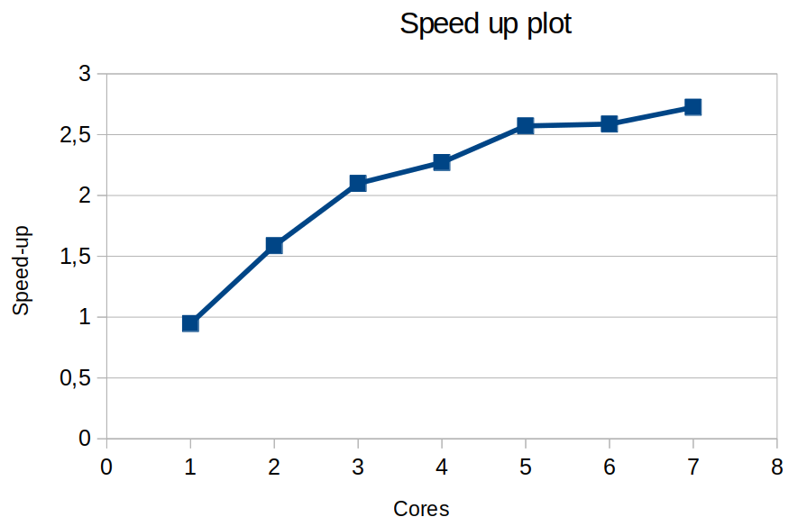

<style>
    h1{
        color: red;
        text-align: center;
        font-size: 50px;
        text-shadow: 2px 2px #ffcccc;
    }
    h2{
        font-weight: bold;
    }
    img {
        height: auto;
        width: 100%;
    }
    note {
        font-weight: lighter;
    }
    p{
        text-align: justify;
    }
    img{
        width: 100%;
        height: auto;
    }
    .center{
        width: 50%;
        height: auto;
        margin-left: auto;
        margin-right: auto;
        display: block;
    }
</style>

# Lab 2

## Introduction

In lab 2 we are going to work with Mandelbrot Set. It is a set of complex numbers. With an algorithm to compute Mandelbrot Set we are going to obvserve how to paralelize in diferent ways. Point method and Row method are the methods we are going to work with.

<div class="page">

## Task descomposition and granularity analysis

 

code:

```
void mandelbrot(int height, 

                int width, 

                double real_min, 

                double imag_min,

                double scale_real, 

                double scale_imag, 

                int maxiter, 

#if _DISPLAY_

                int setup_return,

                Display *display, 

                Window win, 

                GC gc, 

                double scale_color,

                double min_color)

#else

                int ** output) 

#endif

{
            
    for (row = 0; row < height; ++row) {

        tareador_start_task("mandelbrot row loop");

        for (col = 0; col < width; ++col) {

            tareador_start_task("mandelbrot col loop");

            complex z, c;

            z.real = z.imag = 0;

            c.real = real_min + ((double) col * scale_real);
            c.imag = imag_min + ((double) (height-1-row) * scale_imag);
                                        /* height-1-row so y axis displays
                                         * with larger values at top
                                         */

            /* Calculate z0, z1, .... until divergence or maximum iterations */
            int k = 0;
            double lengthsq, temp;
            do  {
                temp = z.real*z.real - z.imag*z.imag + c.real;
                z.imag = 2*z.real*z.imag + c.imag;
                z.real = temp;
                lengthsq = z.real*z.real + z.imag*z.imag;
                ++k;
            } while (lengthsq < (N*N) && k < maxiter);

#if _DISPLAY_

            /* Scale color and display point  */

            long color = (long) ((k-1) * scale_color) + min_color;

            if (setup_return == EXIT_SUCCESS) {       
                SetForeground (display, gc, color);
                XDrawPoint (display, win, gc, col, row);

            }

#else

	    output[row][col]=k;

#endif

			**tareador_end_task("mandelbrot col loop");**

        }

        tareador_end_task("mandelbrot row loop");
    }
}
```

### Which section of teh code is causing the serialization of all tasks

```
            /* Scale color and display point  */

            long color = (long) ((k-1) * scale_color) + min_color;

            if (setup_return == EXIT_SUCCESS) {       
                SetForeground (display, gc, color);
                XDrawPoint (display, win, gc, col, row);

            }
```

Scale cxolor and display point causes dependency in the graphycal version. It uses vars.

The granularity in **point method** is smaller and with 64 threads the execution time is much lower than using **row method**. If you have enough cpus, the **point** strategy is more adequate, as it allows for a lower time, however, **row method** it's worth if you have less cores. You will reduce overhead time.

### Code protection:

X11 use a variable, named X11_COLO_fake, with dependences. With openMP you can declare critical regions. That protects your code while parallelize from decoherences.

<div class="page">

## Point decomposition in OpenMP

The following plots are the time plot and speed up plot which shows the dependence between time or speed up and the number of cores used while the execxution of the program.


add comments




It appears that after 8 threads the speed-up and the execution time plots begin to normalize. Thats cause the mandelbot only saves a great portion of execution time until 8 cores, after that, we only get small bonuses. 

Speed up doesn’t increase any more, then time also doesn’t increase. We can conclude the maximum number of cores that the program can deal with is 5 in that kind of palatalization. 

<div class="page">

## Row decomposition in OpenMP

We have used parallelization pragmas in the row loop. Due to that we got a task descompostion based in rows. This helps reducing overhead time added to the executable. However that coluld translate in a greater execution time. We would see this with the analysis of scalability.


```
void mandelbrot(int height, 
                int width, 
                double real_min, 
                double imag_min,
                double scale_real, 
                double scale_imag, 
                int maxiter, 
#if _DISPLAY_
                int setup_return,
                Display *display, 
                Window win, 
                GC gc, 
                double scale_color,
                double min_color)
#else
                int ** output) 
#endif

{
    /* Calculate points and save/display */
    #pragma omp parallel
	#pragma omp single
	#pragma omp taskloop firstprivate(row) num_tasks(800)
    for (int row = 0; row < height; ++row) {
        for (int col = 0; col < width; ++col) {
            complex z, c;

            z.real = z.imag = 0;

            /* Scale display coordinates to actual region  */
            c.real = real_min + ((double) col * scale_real);
            c.imag = imag_min + ((double) (height-1-row) * scale_imag);
                                        /* height-1-row so y axis displays
                                         * with larger values at top
                                         */

            /* Calculate z0, z1, .... until divergence or maximum iterations */
            int k = 0;
            double lengthsq, temp;
            do  {
                temp = z.real*z.real - z.imag*z.imag + c.real;
                z.imag = 2*z.real*z.imag + c.imag;
                z.real = temp;
                lengthsq = z.real*z.real + z.imag*z.imag;
                ++k;
            } while (lengthsq < (N*N) && k < maxiter);

#if _DISPLAY_
            /* Scale color and display point  */
            
            long color = (long) ((k-1) * scale_color) + min_color;
            if (setup_return == EXIT_SUCCESS) {
				#pragma omp critical (X11)
				{
                XSetForeground (display, gc, color);
                XDrawPoint (display, win, gc, col, row);
				}
            }
#else
	    output[row][col]=k;
#endif
        }
    }
}
```
