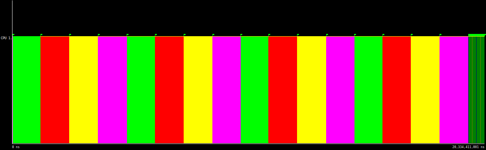

# LAB 3

## Introduction

## Task decomposition analysis for Mergesort

### Divide and conquer

### Task decomposition analysis with Tareador

<note>Trace of multisort-tareador using 1 core</note>

<note>Trace of multisort-tareador using 2 core</note>

<note>Trace of multisort-tareador using 4 core</note>

<note>Trace of multisort-tareador using 8 core</note>

<note>Trace of multisort-tareador using 16 core</note>

<note>Trace of multisort-tareador using 32 core</note>

<note>Trace of multisort-tareador using 64 core</note>

The multisort program parallise as expected untill 16 cores, when , the dependences between the multisort marge calls, as seen in the tareador capture of the tasks, doesn't allow for more. The efficiency drops going further than 16 threads (i.e fig: efficiency plot and 32,64 captures) Proving that adding more cpus is pointless.

