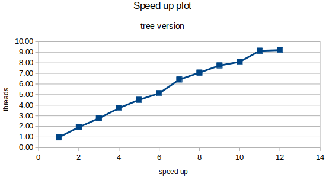

<style>
    @import url('https://fonts.googleapis.com/css?family=VT323');
    h1{
        text-align: center;
        font-size: 50px;
        font-family: 'VT323', monospace;
    }
    h2{
        font-weight: bold;
    }
    h3{
        font-weight: bold;
    }
    img {
        height: auto;
        width: 100%;
    }
    note {
        font-weight: lighter;
        background-color: rgba(100, 100, 100, 0.3);
        font-style: italic;
    }
    p{
        text-align: justify;
    }
    img{
        width: 100%;
        height: auto;
    }
    .center{
        width: 50%;
        height: auto;
        margin-left: auto;
        margin-right: auto;
        display: block;
    }
    .half{
        width: 50%;
        height: auto;
        margin-left: auto;
        margin-right: auto;
    }
    .mini{
        width: 30%;
        height: auto;
        margin-left: auto;
        margin-right: auto;
        display: block;
    }
</style>

# LAB 3

## Introduction

In this laboratory we are going to discuss about the implementation of "divide and conquer" strategy using OpneMP paralization. Fist of all, we will take a look to dependence graph and the potential performance of the algorithm with diferent number of cores.

At second chapter, we will discuss about implementation and the performance of leaf, tree and cut-off. Using paraver and plots of elapsed tiem and speed up.

At last, we are going to modify the implementation of tree method in order to get a task dependence based parallization strategy. Then we are going to compare the performance.

<div class="page">

## Task decomposition analysis for Mergesort

### Divide and conquer

### Task decomposition analysis with Tareador

```
void merge(long n, T left[n], T right[n], T result[n*2], long start, long length) {
	if (length < MIN_MERGE_SIZE*2L) {
		// Base case
		basicmerge(n, left, right, result, start, length);
	} else {
		// Recursive decomposition
		tareador_start_task("merge 0");
		merge(n, left, right, result, start, length/2);
		tareador_end_task("merge 0");
		tareador_start_task("merge 1");
		merge(n, left, right, result, start + length/2, length/2);
		tareador_end_task("merge 1");
	}
}

void multisort(long n, T data[n], T tmp[n]) {
	
		if (n >= MIN_SORT_SIZE*4L) {
				// Recursive decomposition
				tareador_start_task("multisort 0");
				multisort(n/4L, &data[0], &tmp[0]);
		   tareador_end_task("multisort 0");
				tareador_start_task("multisort 1");
				multisort(n/4L, &data[n/4L], &tmp[n/4L]);
				tareador_end_task("multisort 1");
				tareador_start_task("multisort 2");
				multisort(n/4L, &data[n/2L], &tmp[n/2L]);
				tareador_end_task("multisort 2");
				tareador_start_task("multiosrt 3");
				multisort(n/4L, &data[3L*n/4L], &tmp[3L*n/4L]);
				tareador_end_task("multisort 3");
				
				tareador_start_task("merge_multi 0");
				merge(n/4L, &data[0], &data[n/4L], &tmp[0], 0, n/2L);
				tareador_end_task("merge_multi 0");
				tareador_start_task("merge_multi 1");
				merge(n/4L, &data[n/2L], &data[3L*n/4L], &tmp[n/2L], 0, n/2L);
				tareador_end_task("merge_multi 1");
				tareador_start_task("merge_multi 2");
				merge(n/2L, &tmp[0], &tmp[n/2L], &data[0], 0, n);
				tareador_end_task("merge_multi 2");
	} else {
		// Base case
		basicsort(n, data);
	}
}
```
[multisort-tareador.c](codes/multisort-tareador.c)

That peace of code give us the following depencence graph:


We have added a tareador task in each of the recursive tasks, to fully visualize the possible parallelizations of the code.


<note>Trace of multisort-tareador using 1 core</note>


<note>Trace of multisort-tareador using 2 core</note>


<note>Trace of multisort-tareador using 4 core</note>


<note>Trace of multisort-tareador using 8 core</note>


<note>Trace of multisort-tareador using 16 core</note>


<note>Trace of multisort-tareador using 32 core</note>


<note>Trace of multisort-tareador using 64 core</note>


|NUM CPUs|time (ns)|SPEED UP|EFFICIENCY|
|---|---|---|---|
|1|20334411001|1|0.999360066616823|
|2|10173716001|1.99872013323365|0.99938619627572|
|4|5086725001|3.99754478510288|0.99938619627572|
|8|2550595001|7.97241858979085|0.996552323723856|
|16|1289922001|15.7640624667507|0.985253904171916|
|32|1289909001|15.7642213406029|0.492631916893841|
|64|1289909001|15.7642213406029|0.246315958446921|

The following pots represents number of cores vs. plot of time, speed up and efficiency, respectively.


<note>Number of cores vs. execution time plot and number of cores vs. speed up plot.</note>


<note>Number of cores vs. efficiency plot.</note>

The multisort program parallizes ideally untill 16 cores, when , the dependences between the multisort marge calls, as seen in the tareador capture of the tasks, doesn't allow for more. The efficiency drops going further than 16 threads (i.e fig: efficiency plot and 32,64 captures) Proving that adding more CPUs is pointless.

<div class="page">

## Shared-memory parallelization with OpenMP tasks

### Task cut–off mechanism

First of all, we are going to implement two versions of multisort algorithm. One using a tree strategy and another using leaf strategy.

Tree stragey code:
```
void merge(long n, T left[n], T right[n], T result[n*2], long start, long length) {
    if (length < MIN_MERGE_SIZE*2L) {
        // Base case
        basicmerge(n, left, right, result, start, length);
    } else {
        // Recursive decomposition
        #pragma omp taskgroup
        {
            #pragma omp task
            merge(n, left, right, result, start, length/2);
            #pragma omp task
            merge(n, left, right, result, start + length/2, length/2);
        }
    }
}

void multisort(long n, T data[n], T tmp[n]) {
    if (n >= MIN_SORT_SIZE*4L)
    {
        #pragma omp taskgroup
        {
            #pragma omp task
            multisort(n/4L, &data[0], &tmp[0]);
            #pragma omp task
            multisort(n/4L, &data[n/4L], &tmp[n/4L]);
            #pragma omp task
            multisort(n/4L, &data[n/2L], &tmp[n/2L]);
            #pragma omp task
            multisort(n/4L, &data[3L*n/4L], &tmp[3L*n/4L]);
        }
        #pragma omp taskgroup
        {
            #pragma omp task
            merge(n/4L, &data[0], &data[n/4L], &tmp[0], 0, n/2L);
            #pragma omp task
            merge(n/4L, &data[n/2L], &data[3L*n/4L], &tmp[n/2L], 0, n/2L);
            //#pragma omp taskwait
        }
        #pragma omp task
        merge(n/2L, &tmp[0], &tmp[n/2L], &data[0], 0, n);
	}
    else
    {
		basicsort(n, data);
	}
}
```
[multisort-omp-tree.c](codes/multisort-omp-tree.c)


<note> Paraver capture of number of tasks created using tree strategy</note>

Leaf stragegy code:
```
void multisort(long n, T data[n], T tmp[n]) {
        if (n >= MIN_SORT_SIZE*4L) {
                // Recursive decomposition
                multisort(n/4L, &data[0], &tmp[0]);
                multisort(n/4L, &data[n/4L], &tmp[n/4L]);
                multisort(n/4L, &data[n/2L], &tmp[n/2L]);
                multisort(n/4L, &data[3L*n/4L], &tmp[3L*n/4L]);

                merge(n/4L, &data[0], &data[n/4L], &tmp[0], 0, n/2L);
                merge(n/4L, &data[n/2L], &data[3L*n/4L], &tmp[n/2L], 0, n/2L);

                merge(n/2L, &tmp[0], &tmp[n/2L], &data[0], 0, n);
	} 
    else {
		// Base case
		#pragma omp taskgroup
		{
			#pragma omp task
			basicsort(n, data);
		}
		//#pragma omp taskwait
	}
}
```
[multisort-omp-leaf.c](codes/multisort-omp-leaf.c)


<note> Paraver capture of number of tasks created using leaf strategy</note>

For the cut-off stragegy we need to marge tree and leaf methods. Until a specified number of created tasks the program will create tasks like tree strategy, recursively. Then, when the limit is reached, the program is going to create sequentially one task for each leaf of leaf task.

Cut-off strategy code:

```
void merge(long n, T left[n], T right[n], T result[n*2], long start, long length) {
        if (length < MIN_MERGE_SIZE*2L) {
                // Base case
                basicmerge(n, left, right, result, start, length);
        } else {
                if(NUM_TASKS < CUTOFF){
					#pragma omp taskgroup
					{	
						NUM_TASKS++;
						#pragma omp task
						merge(n, left, right, result, start, length/2);
						NUM_TASKS++;
						#pragma omp task
						merge(n, left, right, result, start + length/2, length/2);
					}
					NUM_TASKS -= 2;
				}
				else{
					merge(n, left, right, result, start, length/2);
					merge(n, left, right, result, start + length/2, length/2);
				}
        }
}

void multisort(long n, T data[n], T tmp[n]) {
        if (n >= MIN_SORT_SIZE*4L) {
                // Recursive decomposition
                if(NUM_TASKS < CUTOFF){
					#pragma omp taskgroup
					{
						NUM_TASKS++;
						#pragma omp task
						multisort(n/4L, &data[0], &tmp[0]);
						NUM_TASKS++;
						#pragma omp task
						multisort(n/4L, &data[n/4L], &tmp[n/4L]);
						NUM_TASKS++;
						#pragma omp task
						multisort(n/4L, &data[n/2L], &tmp[n/2L]);
						NUM_TASKS++;
						#pragma omp task
						multisort(n/4L, &data[3L*n/4L], &tmp[3L*n/4L]);
					}
					NUM_TASKS -= 4;
					#pragma omp taskgroup
					{
						NUM_TASKS++;
						#pragma omp task
						merge(n/4L, &data[0], &data[n/4L], &tmp[0], 0, n/2L);
						NUM_TASKS++;
						#pragma omp task
						merge(n/4L, &data[n/2L], &data[3L*n/4L], &tmp[n/2L], 0, n/2L);
						//#pragma omp taskwait
					}
					NUM_TASKS -= 2;
					
					NUM_TASKS++;
					#pragma omp task
					merge(n/2L, &tmp[0], &tmp[n/2L], &data[0], 0, n);
				}
				else{
					// Recursive decomposition
					multisort(n/4L, &data[0], &tmp[0]);
					multisort(n/4L, &data[n/4L], &tmp[n/4L]);
					multisort(n/4L, &data[n/2L], &tmp[n/2L]);
					multisort(n/4L, &data[3L*n/4L], &tmp[3L*n/4L]);

					merge(n/4L, &data[0], &data[n/4L], &tmp[0], 0, n/2L);
					merge(n/4L, &data[n/2L], &data[3L*n/4L], &tmp[n/2L], 0, n/2L);

					merge(n/2L, &tmp[0], &tmp[n/2L], &data[0], 0, n);
				}
	} else {
		if(NUM_TASKS >= CUTOFF){
			#pragma omp task
			basicsort(n, data);
			#pragma omp taskwait
		}
		else{
			basicsort(n, data);
		}
	}
}
```
[multisort-omp-cutoff.c](codes/multisort-omp-cutoff.c)


<note> Paraver capture of number of tasks created using cut-off strategy</note>

Down bellow we are going to study the strong scalability of the three diferent versions of the multisort algorithm using cores vs time/speed up plots.


<note>Elapsed time plot and speed up plot for tree version of multisort algorithm</note>


<note>Elapsed time plot and speed up plot for leaf version of multisort algorithm</note>


<note>PostScript plots generated by submit-cutoff.sh</note>

We can observe that the speed up at first plot (using the execution time of the whole program) reach a limit 10 cores equal than the second plot (only using the time of multisort function). Nevertheless  the scalability ratio is better on the second plot, because is where the parallelization makes higher work.

<div class="page">

## Using OpenMP task dependencies

At last, we are going to implement, based in tree strategy, a task dependence model.

```
void merge(long n, T left[n], T right[n], T result[n*2], long start, long length) {
   if (length < MIN_MERGE_SIZE*2L) {
      // Base case
      basicmerge(n, left, right, result, start, length);
   } else {
      // Recursive decomposition
      #pragma omp task depend(in:left,right) depend(out:result)
      merge(n, left, right, result, start, length/2);
      #pragma omp task depend(in:left,right) depend(out:result)
      merge(n, left, right, result, start + length/2, length/2);
      
      #pragma omp taskwait
   }
}

void multisort(long n, T data[n], T tmp[n]) {
        if (n >= MIN_SORT_SIZE*4L) {
			// Recursive decomposition
			#pragma omp task depend(out:data[0])
			multisort(n/4L, &data[0], &tmp[0]);
			#pragma omp task depend(out:data[n/4L])
			multisort(n/4L, &data[n/4L], &tmp[n/4L]);
			#pragma omp task depend(out:data[n/2L])
			multisort(n/4L, &data[n/2L], &tmp[n/2L]);
			#pragma omp task depend(out:data[3L*n/4L])
			multisort(n/4L, &data[3L*n/4L], &tmp[3L*n/4L]);

			#pragma omp task depend(in: data[0], data[n/4L]) depend(out: tmp[0])
			merge(n/4L, &data[0], &data[n/4L], &tmp[0], 0, n/2L);
			#pragma omp task depend(in: data[n/2L], data[3L*n/4L]) depend(out: tmp[n/2L])
			merge(n/4L, &data[n/2L], &data[3L*n/4L], &tmp[n/2L], 0, n/2L);

			#pragma omp task depend(in: tmp[0],tmp[n/2L])
			merge(n/2L, &tmp[0], &tmp[n/2L], &data[0], 0, n);
			
			#pragma omp taskwait
	} else {
		// Base case
		basicsort(n, data);
	}
}
```
[multisort-omp-depencences.c](codes/multisort-omp-depencences.c)

In marge function, every marge call depends of left and write as in and result as out. Is is caused bey basicmarge because it have to read from right to left and write to result.

In multisort function, multisort recursive calls needs to write on data array, then it has a out dependence in data array. Every marge call depends of a block of the data array and a it needs to write in tmp array at sema possition than data array.


With the a fist look at the plots we can see that executing the program with more than 4 cores the speed up. You also can observe that The speed up 2 plot, that taks the speed up of the parallel part of the program, the speed up is from 1 to 1.5 times greater than the speed up of the whole program (speed-up 1 plot).

<div class="page">
	
## Optional 2 - Parallelization of initialize and clear
In this optional we expanded the tree versions adding paralelitzation in the initialization of the tmp and data vectors. We choosed to not implement any specific schedule to the for, becouse they didn't improve over the default version.


We got an overall better time than the basic tree version, even if it's not very noticable, it's worth the implementation if done correctly. For example, scheduling with static and n=1, pushes the initialize time up to 2s.

[multisort-omp-optional2.c] (codes/multisort-omp-optional2.c)
...
static void initialize(long length, T data[length]) {
   long i;
   #pragma omp parallel for private(i)
   for (i = 0; i < length; i++) {
      if (i==0) {
         data[i] = rand();
      } else {
         data[i] = ((data[i-1]+1) * i * 104723L) % N;
      }
   }
}

static void clear(long length, T data[length]) {
   long i;
      #pragma omp parallel for private(i)
   for (i = 0; i < length; i++) {
      data[i] = 0;
   }
}
...

## Conclusions
In this assigment, we explored different ways to paralelizise a recursive portion of a program. Tree or leaf.
With our results we concluded that, due to the nature of the code, a tree strategy will aport better results as seen in the time and speed up versions. Where while the gain of the first method is great, the leaf version doesn't improve at all, in fact, it decreases.

Further exploring the tree version, we implemented a data dependence paralelitzation, avoiding as many task synchronizations as we could. However, we didn't manage to improve over the previous version . This may be becouse some redoundant dependencies.
