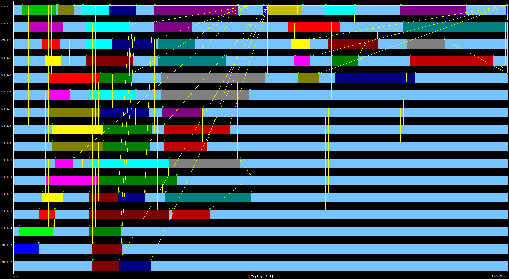

<style>
    @import url('https://fonts.googleapis.com/css?family=VT323');
    h1{
        text-align: center;
        font-size: 50px;
        font-family: 'VT323', monospace;
    }
    h2{
        font-weight: bold;
    }
    h3{
        font-weight: bold;
    }
    img {
        height: auto;
        width: 100%;
    }
    note {
        font-weight: lighter;
        background-color: rgba(100, 100, 100, 0.3);
        font-style: italic;
    }
    p{
        text-align: justify;
    }
    img{
        width: 100%;
        height: auto;
    }
    .center{
        width: 50%;
        height: auto;
        margin-left: auto;
        margin-right: auto;
        display: block;
    }
    .half{
        width: 50%;
        height: auto;
        margin-left: auto;
        margin-right: auto;
    }
    .mini{
        width: 30%;
        height: auto;
        margin-left: auto;
        margin-right: auto;
        display: block;
    }
</style>

# LAB 4
## <center>Branch and bound with OpenMP: N-queens puzzle</center>

<br></br>
#### <center>2018-2019 Q1<center>
<br></br><br></br><br></br><br></br><br></br><br></br><br></br>
<br></br><br></br><br></br><br></br></br><br></br>
### <center>Par2013</center>
### <center>Daniel Palomo Cabrera i David Soldevila Puigbi</center>

<div class="page">

## Introduction

First of all, we are going to understand the nqueens algorithm. It consist of a recursive algorithm that tries to put N chess queens into a N x N chess table in order that every queen doesn’t attack any other queen (no column, row or diagonal is shared).

<div class="page">

## Understanding the potential parallelism in Nqueens

Executing the sequential version of the program with 12 queens in a table of 12 x 12 the program gives us the following output:

```
  board size:              12
  recursion cutoff level:  8

one solution:  0  2  4  7  9 11  5 10  1  6  8  3

number of solutions: 14200
```

Lets discuss about the parallelization of the algorithm using Tareador. First take a look at the dependence graph for the execution of the algorithm with n equals 4.


<note>Dependence grpah generated by Tareador</note>

Even thought Tareador shows that block with id 1 (bottom left) at the second row it can be executed at the same time of the blocks in the first row. Note this at the simulation with different number of cores. 


<note>Simulation of execution of nqeens using 1 core</note>

<note>Simulation of execution of nqeens using 2 core</note>

<note>Simulation of execution of nqeens using 4 core</note>

<note>Simulation of execution of nqeens using 8 core</note>

<note>Simulation of execution of nqeens using 16 core</note>

With 32 cores the time is exactly the same as the 16 cores simulation. 

<div class="page">

## Shared-memory parallelization

At last we will parallelice the nqueen algoritm using OpenMP. 