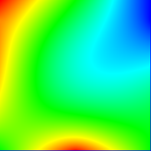
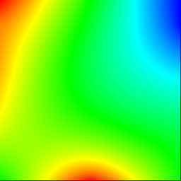
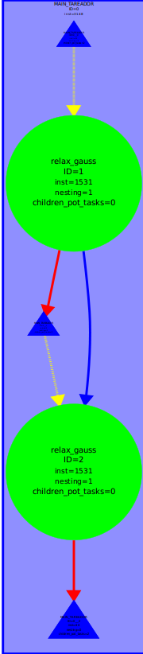

<style>
    @import url('https://fonts.googleapis.com/css?family=VT323');
    h1{
        text-align: center;
        font-size: 50px;
        font-family: 'VT323', monospace;
    }
    h2{
        font-weight: bold;
    }
    h3{
        font-weight: bold;
    }
    img {
        height: auto;
        width: 100%;
    }
    note {
        font-weight: lighter;
        background-color: rgba(100, 100, 100, 0.3);
        font-style: italic;
    }
    p{
        text-align: justify;
    }
    img{
        width: 100%;
        height: auto;
    }
    .center{
        width: 50%;
        height: auto;
        margin-left: auto;
        margin-right: auto;
        display: block;
    }
    .half{
        width: 50%;
        height: auto;
        margin-left: auto;
        margin-right: auto;
    }
    .mini{
        width: 30%;
        height: auto;
    }
</style>

# LAB 5
## <center>Geometric (data) decomposition: heat diffusion equation</center>

<br></br>
#### <center>2018-2019 Q1<center>
<br></br><br></br><br></br><br></br><br></br><br></br><br></br>
<br></br><br></br><br></br><br></br></br><br></br>
### <center>Par2013</center>
### <center>Daniel Palomo Cabrera i David Soldevila Puigbi</center>

<div class="page">

## Introduction


<div class="page">

## Sequential heat diffusion program

First of all, lets execute the sequential versions of heat, one using Jacobi algorithm and an otherone using Gauss-Seidel algorithm.

Jacobi solver:

```
Iterations        : 25000
Resolution        : 254
Algorithm         : 0 (Jacobi)
Num. Heat sources : 2
   1: (0.00, 0.00) 1.00 2.50 
   2: (0.50, 1.00) 1.00 2.50 
Time: 5.365 
Flops and Flops per second: (11.182 GFlop => 2084.06 MFlop/s)
Convergence to residual=0.000050: 15756 iterations
```

Result heat map:



```
Iterations        : 25000
Resolution        : 254
Algorithm         : 1 (Gauss-Seidel)
Num. Heat sources : 2
   1: (0.00, 0.00) 1.00 2.50 
   2: (0.50, 1.00) 1.00 2.50 
Time: 6.305 
Flops and Flops per second: (8.806 GFlop => 1396.78 MFlop/s)
Convergence to residual=0.000050: 12409 iterations
```

Result heat map:



<div class="page">

## Analysis with Tareador

Now we are going to study tareador dependences graphs. We got two diferents gaphs, one with Jacovi solver algorithm and another with Gauss-Seidel algorithm.

 

<note>Dependnece graph of the program using Gauss-Seidel and Jacovi algorthms.</note>

As we can observe at the graphs 