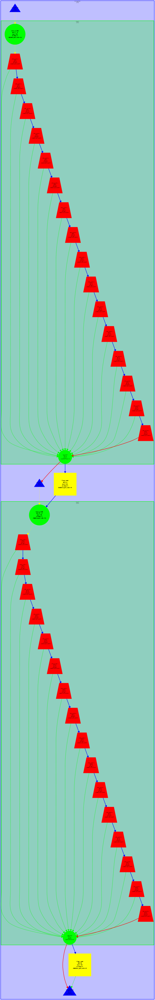
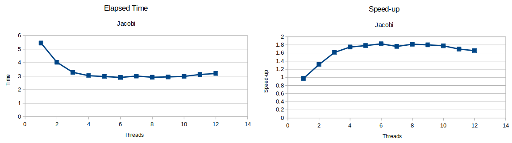

<style>
    @import url('https://fonts.googleapis.com/css?family=VT323');
    h1{
        text-align: center;
        font-size: 50px;
        font-family: 'VT323', monospace;
    }
    h2{
        font-weight: bold;
    }
    h3{
        font-weight: bold;
    }
    img {
        height: auto;
        width: 100%;
    }
    note {
        font-weight: lighter;
        background-color: rgba(100, 100, 100, 0.3);
        font-style: italic;
    }
    p{
        text-align: justify;
    }
    img{
        width: 100%;
        height: auto;
    }
    .center{
        width: 50%;
        height: auto;
        margin-left: auto;
        margin-right: auto;
        display: block;
    }
    .half{
        width: 50%;
        height: auto;
        margin-left: auto;
        margin-right: auto;
    }
    .mini{
        width: 30%;
        height: auto;
    }
</style>

# LAB 5
## <center>Geometric (data) decomposition: heat diffusion equation</center>

<br></br>
#### <center>2018-2019 Q1<center>
<br></br><br></br><br></br><br></br><br></br><br></br><br></br>
<br></br><br></br><br></br><br></br></br><br></br>
### <center>Par2013</center>
### <center>Daniel Palomo Cabrera i David Soldevila Puigbi</center>

<div class="page">

## Introduction

In the last session of Par, we are going to study the potencial parallel performance of two heat diffusion algorithms, Jacobi and Gauss-Seidel. Then we are going to parallelize the code using OpenMP.

<div class="page">

## Sequential heat diffusion program

First of all, lets execute the sequential version of heat twice, one using Jacobi algorithm and the other using Gauss-Seidel algorithm.

Jacobi solver:

```
Iterations        : 25000
Resolution        : 254
Algorithm         : 0 (Jacobi)
Num. Heat sources : 2
   1: (0.00, 0.00) 1.00 2.50 
   2: (0.50, 1.00) 1.00 2.50 
Time: 5.365 
Flops and Flops per second: (11.182 GFlop => 2084.06 MFlop/s)
Convergence to residual=0.000050: 15756 iterations
```

Result heat map:


```
Iterations        : 25000
Resolution        : 254
Algorithm         : 1 (Gauss-Seidel)
Num. Heat sources : 2
   1: (0.00, 0.00) 1.00 2.50 
   2: (0.50, 1.00) 1.00 2.50 
Time: 6.305 
Flops and Flops per second: (8.806 GFlop => 1396.78 MFlop/s)
Convergence to residual=0.000050: 12409 iterations
```

Result heat map:


<div class="page">

## Analysis with Tareador

Now we are going to study Tareador dependences graphs. We got two diferents graphs, one with Jacovi solver algorithm and another with Gauss-Seidel algorithm.

 

<note>Dependnece graph of the program using Gauss-Seidel and Jacovi algorthms.</note>

Observing the first dependence graph we can conclude that there are data dependences from sum. Depencences come from two different iterations in some cases.

As we can observe at the jacobi graph also exists a data dependence between interations of jacobi_rexlax loop. The variable that cuase that dependence is sum form the previous iteration. It could be parallelized using a reduction. 

<div class = "page">

## Parallelization of Jacobi With OpenMP parallel

In order to parallelize the jacobi solver function we used a parallel region with a reductiono n sum and declaring diff as a private variable.
We tried to replace the reduction clause with atomic or critical on sum but we didn't manage to get a satisfactory performance, or any at all. This may be cause the optimitations within the reduction.

The resulting code is:
```
double relax_jacobi (double *u, double *utmp, unsigned sizex, unsigned sizey)
{
  double diff, sum=0.0;
  #pragma omp parallel private(diff) reduction (+:sum) 
  {
    int funci= omp_get_thread_num();
  int thre = omp_get_num_threads();
  int i_start = lowerb(funci, thre, sizex);
  int i_end = upperb(funci, thre, sizex);
  
  for (int i=max(1, i_start); i<= min(sizex-2, i_end); i++) {
    for (int j=1; j<= sizey-2; j++) {
      utmp[i*sizey+j]= 0.25 * ( u[ i*sizey + (j-1) ]+  // left
                                u[ i*sizey + (j+1) ]+  // right
                                u[ (i-1)*sizey + j ]+  // top
                                u[ (i+1)*sizey + j ]); // bottom
      diff = utmp[i*sizey+j] - u[i*sizey + j];
      sum += diff * diff; 
    }
  }
  }
  return sum;
}
```
[solver-omp.c](codes/solver-omp.c)

With that parallelization strategy we got the following plots:



Here we can see a clearly stop in performance gain at 4 cores, we aren't sure why it stops so abruptly, maybe is because the nature of the code, or an undersight by our part.  We also see a small decrease in speed-up, ( and its consequentially rise in elapsed time) at eleven threads, probably due to overheads.

<div class="page">

## Parallelization of Gauss-Seidel with OpenMP ordered

To parallelize the gauss algorithm we must use ordered clause. It indicate a block of code that has to be executed sequentially, additionally you can specify a number of variables as a dependency of that execution.

Using that principle the resulting code is:

```
double relax_gauss (double *u, unsigned sizex, unsigned sizey)
{
    double unew, diff, sum=0.0;
    int howmany = 24;
    int chunkx = sizex/howmany;
    int chunky = sizey/howmany;
    #pragma omp parallel for reduction(+:sum) ordered(2)
    for(int bx = 0; bx < sizex/chunkx; bx++){
        for(int by = 0; by < sizey/chunky; by++){
            int i_start = lowerb(bx, howmany, sizex);
            int i_end = upperb(bx, howmany, sizex);
            int j_start = lowerb(by, howmany, sizey);
            int j_end = upperb(by, howmany, sizey);
            #pragma omp ordered depend(source)
            {
                for (int i=max(1, i_start); i<= min(sizex-2, i_end); i++) {
                    for (int j=max(1, j_start); j<= min(sizey-2, j_end); j++) {
                        unew= 0.25 * ( u[ i*sizey + (j-1) ]+    // left
                                       u[ i*sizey + (j+1) ]+    // right
                                       u[ (i-1)*sizey + j ]+    // top
                                       u[ (i+1)*sizey + j ]);   // bottom
                        diff = unew - u[i*sizey+j];
                        sum += diff * diff;
                        u[i*sizey+j]=unew;
                    } 
                }
            }
        }  
    }
  return sum;
}
```
[solver-omp.c](codes/solver-omp.c)

The resulting plots of the strong scalability of that code is:


We can observe that it reach the limit of performance at 6 threads. In comparation with jacobi solver, that mothod is more paralellizable and perform better. At 12 cores Gauss solver is about 3 times faster than the other one. And also the paralellization limit is higher.

Now let's study the traces with Paraver.


<div class="page">

## Conclusions
